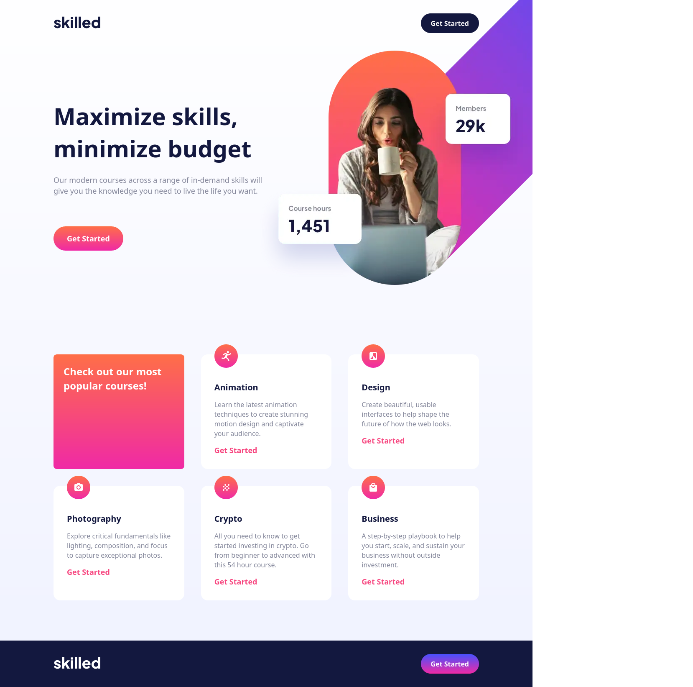
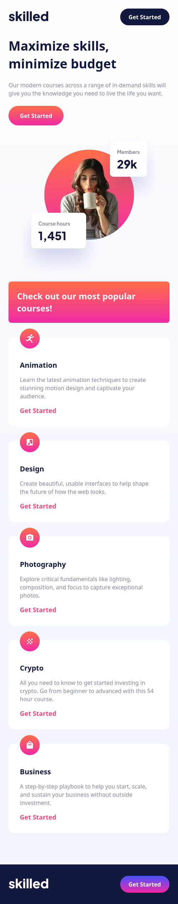

## My process

This one went pretty well. I preplanned by taking a screenshot and editing it in gimp.
I drew the lines where I thought of as containers and marked what each would be. header, main, nav, article, etc... After that I set up the structure in html and css.
css I did a reset and added a temp color pallet which makes it easier to set colors that pop up on intellisense. Then started mobile first. the gimp pic I started desktop. After that, it went pretty smoothly. About to call it done I noticed my top button would change on hover when screen sizes changed. I quickly figured out it was due to the image being bigger than it showed. It was covering my button invisibly so I set z-index and that fixed it

### Screenshot

